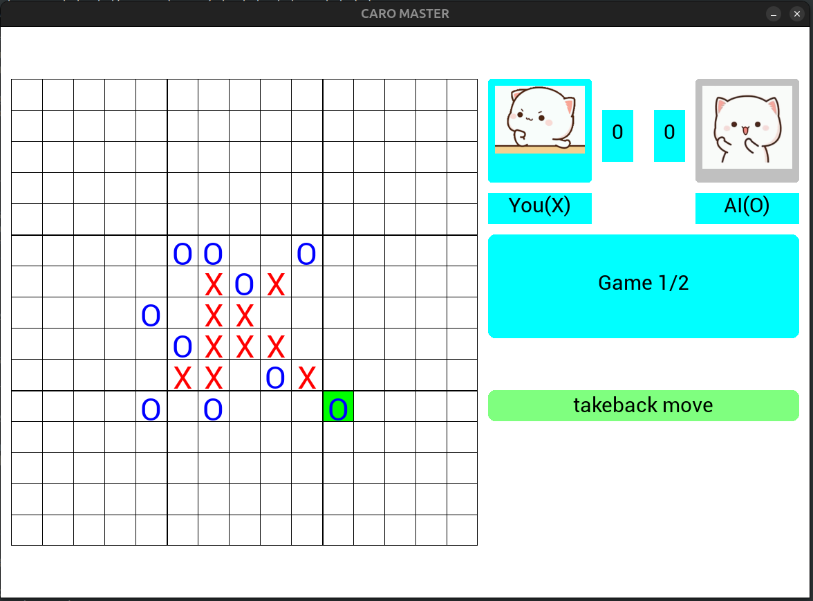
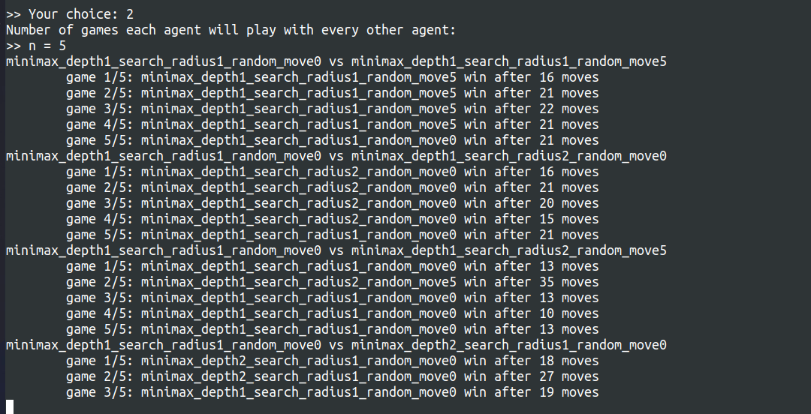

# CaroMaster
[Xem bản tiếng Việt](README.md)

This is a Caro-playing program using the Minimax algorithm.
 
This is my team project for the course: `Introduction to Artificial Intelligence`.

Team members:

| **Member Name**  | **Student ID** |
|------------------|----------------|
| Trần Thái Sơn    | N22DCCN170     |
| Triệu Việt Thành | N22DCCN177     |
| Lê Hoàng Thắng   | N22DCCN178     |
| Lê Ngọc Tú       | N22DCCN193     |

## Installation & Running Guide

### Download project

    git clone https://github.com/TuLe142857/CaroMaster.git
    cd CaroMaster

### Install virtual environment

Window

    python -m venv .venv
    .venv\Script\activate

Macos/Linux

    python3 -m venv .venv
    source .venv/bin/activate

### Install requirement & run
    
    pip install -r requirements.txt 
    python (or python3) src/main.py

## Algorithm

### Minimax Algorithm

The `Minimax` algorithm is a classic method used in turn-based adversarial games such as Caro, Chess, ....

#### Base Algorithm

The core idea is to assume both players play optimally:
- The MAX player tries to maximize the evaluation score.
- The MIN player tries to minimize the evaluation score (i.e., reduce MAX's advantage).

We define the evaluation function as follows:
- `0`: the game is balanced.
- `> 0`: MAX is favored.
- `< 0`: MIN is favored.
- `+∞`: MAX wins.
- `−∞`: MIN wins.

At each turn:
- The MAX player chooses the move with the highest possible evaluation score.
- The MIN player chooses the move with the lowest possible evaluation score.

)

#### Algorithm Optimization:
- Alpha-beta pruning
- Limiting the search radius
- Randomly selecting n moves outside the search radius 
to avoid missing potential good moves

### Evaluation Function
Since searching too deep in the game tree is computationally expensive, we limit the search depth and use an evaluation 
function to estimate the advantage at intermediate (non-terminal) states.

Main ideas:
- The advantage is based on continuous sequences of the same pieces (horizontal, vertical, diagonal).
- Only count sequences that can potentially be extended to form 5 in a row. For example, `OXXXXO` is blocked at both 
ends and is not considered valuable.

Evaluation steps:
- Traverse the board and identify continuous sequences of the same type.
- Ignore sequences that cannot be extended to 5.
- Classify valid sequences by length and number of open ends (1 or 2).
- Assign scores accordingly.
- The next player also affects the evaluation: if both players have open-ended fours, the one who moves next has the 
winning edge.

## Demo Screenshots

### Main menu:

### Playing vs AI:

### Running a tournament between different AI configurations:

### Analyzing match results:

👉 **Best choice**: 
- **Depth** = 2
- **Search Radius** = 1
- **Random Move** = 5 (or 0)