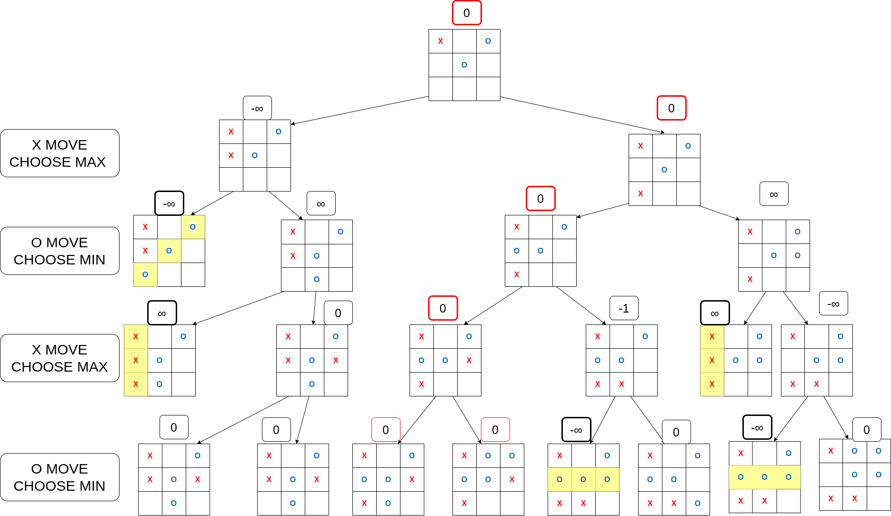
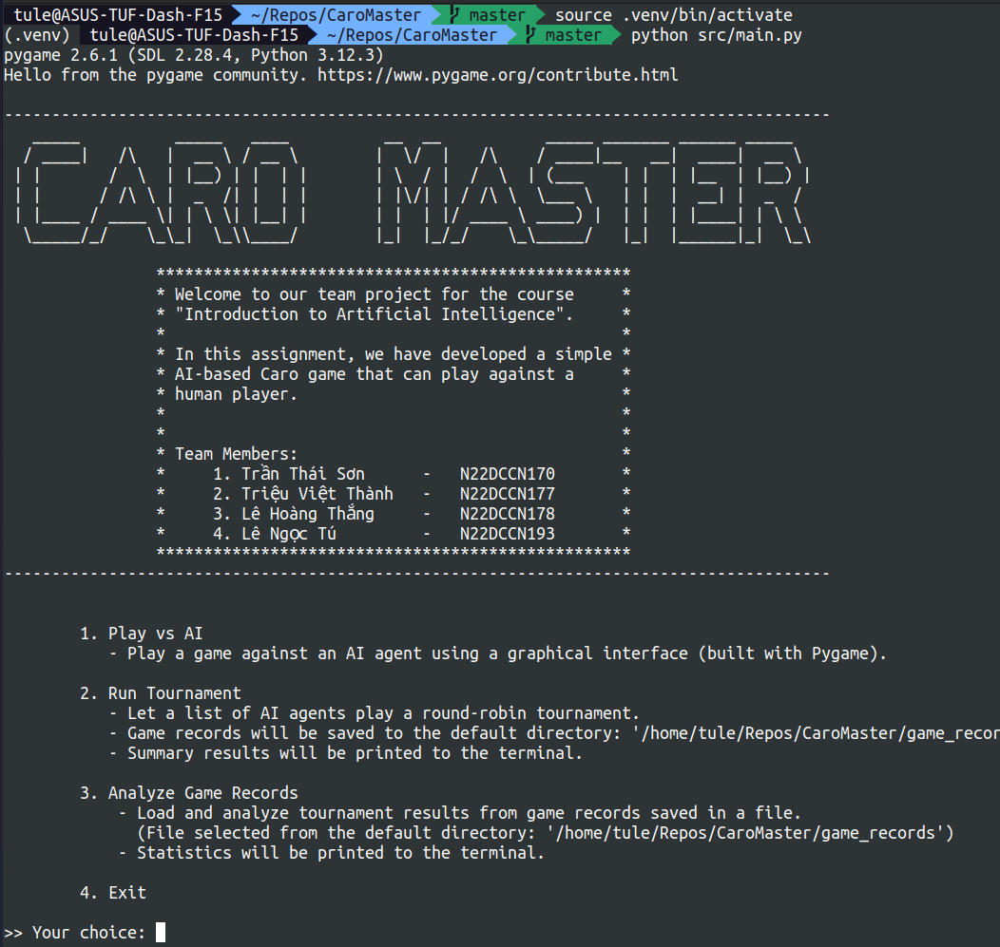
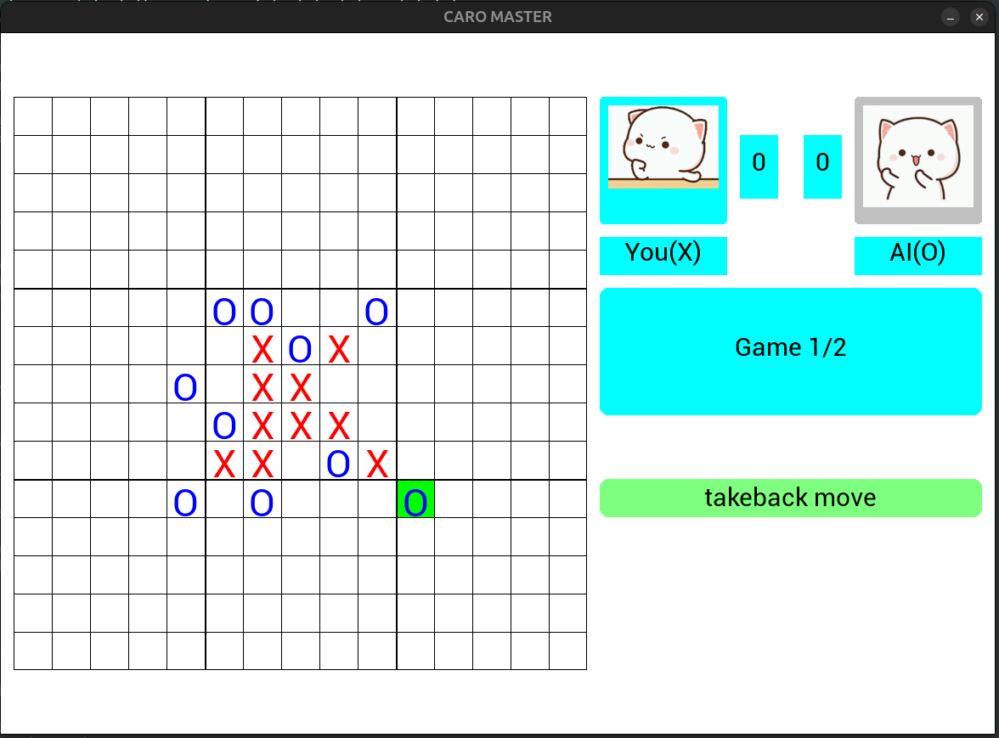
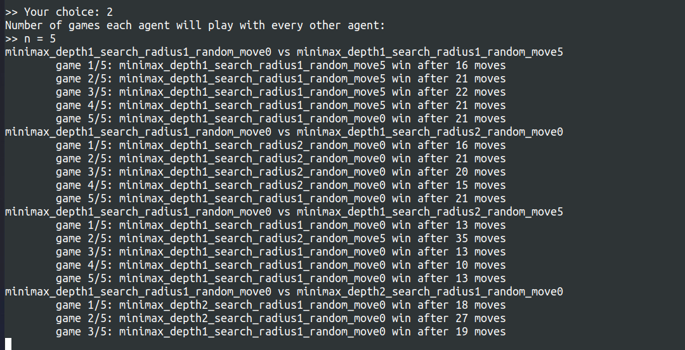

# CaroMaster
[Read in English version](README.en.md)

Chương trình chơi cờ Caro sử dụng thuật toán Minimax.

Đây là bài tập nhóm môn `Nhập môn trí tuệ nhân tạo`.

Thành viên :

| **Tên**          | **Mã số sinh viên** |
|------------------|---------------------|
| Trần Thái Sơn    | N22DCCN170          |
| Triệu Việt Thành | N22DCCN177          |
| Lê Hoàng Thắng   | N22DCCN178          |
| Lê Ngọc Tú       | N22DCCN193          |

## Hướng dẫn cài đặt, chạy chương trình

### Download project

    git clone https://github.com/TuLe142857/CaroMaster.git
    cd CaroMaster

### Install virtual environment

Window

    python -m venv .venv
    .venv\Scripts\activate

Macos/Linux

    python3 -m venv .venv
    source .venv/bin/activate

### Install requirement & run
    
    pip install -r requirements.txt
    python/python3 src/main.py

## Thuật toán

### Thuật toán Minimax

Thuật toán Minimax là một phương pháp phổ biến được dùng trong các trò chơi đối kháng luân phiên như cờ Caro, cờ vua, 
cờ tướng,... 

#### Thuật toán cơ bản

Ý tưởng cốt lõi của thuật toán là giả định rằng cả hai người chơi đều chơi tối ưu:
- Người chơi MAX cố gắng tối đa hóa điểm số lợi thế của mình.
- Người chơi MIN cố gắng tối thiểu hóa điểm số (tức làm giảm lợi thế của MAX).

Ta định nghĩa hàm đánh giá lợi thế tại một trạng thái sẽ trả về các giá trị như sau:
- `0` nếu hai bên đang cân bằng.
- `> 0` nếu bên MAX có lợi.
- `< 0` nếu bên MIN có lợi.
- `+∞` nếu MAX thắng.
- `-∞` nếu MIN thắng.

Với cách đánh giá này, tại mỗi lượt đi:
- Người chơi MAX sẽ chọn nước đi sao cho điểm đánh giá càng cao càng tốt.
- Người chơi MIN sẽ chọn nước đi sao cho điểm đánh giá càng thấp càng tốt.

#### Tối ưu thuật toán:
- Cắt tỉa alpha, beta
- Giới hạn phạm vi tìm kiếm
- Lấy  ngẫu nhiên n nước đi bên ngoài phạm vi tìm kiếm để tránh trường hợp bỏ sót nước đi 

### Hàm đánh giá
Do không thể tìm kiếm quá sâu bằng Minimax vì tốn nhiều thời gian, chương trình giới hạn độ sâu và sử dụng hàm đánh 
giá để ước lượng lợi thế ở các trạng thái chưa phân thắng bại.

Ý tưởng chính:
- Lợi thế được xác định qua các chuỗi quân liên tiếp (ngang, dọc, chéo).
- Chỉ tính các chuỗi còn khả năng mở rộng thành 5 quân. Ví dụ 
`OXXXXO` bị chặn hai đầu nên không được tính.

Cách đánh giá:
- Duyệt toàn bộ bàn cờ để tìm các chuỗi liên tiếp cùng loại quân.
- Bỏ qua chuỗi không thể kéo dài thành 5.
- Phân loại các chuỗi còn lại theo độ dài và số đầu mở (1 hoặc 2).
- Gán điểm cho từng loại.
- Lượt đi tiếp theo cũng ảnh hưởng đến điểm đánh giá: nếu cả hai đều có chuỗi 4, bên đi trước sẽ có lợi thế hơn.

## Ảnh demo kết quả chạy chương trình

### Main menu:

### Chơi với máy 

### Cho các ai với thông số khác nhau thi đấu với nhau

### Phân tích, đánh giá kết quả

👉 **Best choice**: 
- **Depth** = 2
- **Search Radius** = 1
- **Random Move** = 5 (hoặc 0)